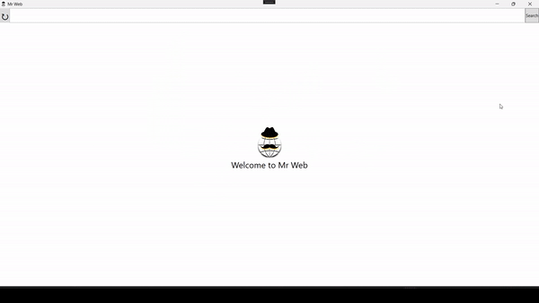

# MrBrowser

## Introduction

Welcome to MrBrowser, a modern web browsing application crafted with C# and the .NET framework, leveraging the power of Windows Presentation Foundation (WPF). Our goal is to provide a fast, efficient, and user-friendly browsing experience.

## Features

- **Efficient Browsing**: Experience fast and responsive web browsing.
- **Intuitive UI**: A clean and easy-to-navigate user interface, thanks to WPF.
- **Customization**: Personalize your browsing experience with various customization options.
- **Regular Updates**: Look forward to new features and improvements.

# Releases
## Phase One:
In this first release you'll be able to use the browser by cloning the repo
## Phase Two:
Next release will include an hosted website with the possibility to download directly the .exe file from there

## Getting Started with this project

### Prerequisites

Before you begin, ensure you have the following installed:
- Windows Operating System
- .NET Framework
- - Microsoft Visual Studio

### Installation

To get MrBrowser up and running:

1. Clone the repository:
   git clone https://github.com/YourGitHubProfile/MrBrowser.git
2. Open the project in Visual Studio or a similar IDE.  
3. Build the project and run the executable from the build directory.

4. ## Showcasing MrBrowser

Here's a glimpse of MrBrowser in action! (Link your GIF or video here)
